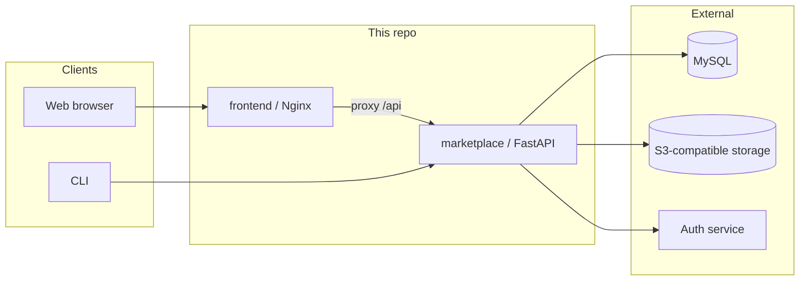

# SkillHub

[](LICENSE)
[](marketplace/pyproject.toml)
[](frontend/package.json)

**简体中文**: [README_zh.md](README_zh.md)

**SkillHub** is an open-source **Skill hosting and distribution** implementation in the openJiuwen ecosystem, intended for self-hosted team deployments.

**ClawHub compatibility** can be enabled so existing ClawHub-oriented CLIs and tools can integrate (exact routes and semantics follow this codebase).

## Contents

- [Features](#features)
- [Architecture](#architecture)
- [Stack & prerequisites](#stack--prerequisites)
- [Quick start](#quick-start)
- [Documentation](#documentation)
- [Security](#security)
- [Contributing](#contributing)
- [License](#license)

## Features

- **Marketplace service**: publish and version Skills, list/detail, presigned downloads; optional **ClawHub-compatible** API surface.
- **CLI**: search, resolve, and download — [`cli/README.md`](cli/README.md).
- **Web UI**: browser-based flows — build/run notes in [`docker/README.skillhub-frontend.md`](docker/README.skillhub-frontend.md).

**Hosted offering**: **[swarmskills.openjiuwen.com](https://swarmskills.openjiuwen.com)**. Use this repository when you need on-premises data, isolation, or internal integration.

## Architecture



## Stack & prerequisites

| Piece | Notes |
|------|--------|
| **marketplace** | Python **≥ 3.11.4**, FastAPI / SQLAlchemy — [`marketplace/pyproject.toml`](marketplace/pyproject.toml) |
| **frontend** | React 18, Vite, MUI — **Node.js 18+ or 20 LTS** recommended |
| **Data** | **MySQL** (required); **MinIO** or **Huawei OBS** (S3-compatible, required) |
| **Auth** | Configurable auth endpoint (`AUTH_*` in `.env` — see **[`.env.example`](.env.example)**) |

Never commit secrets; copy `.env.example` to `.env` locally.

## Quick start

### Hosted

Use **[swarmskills.openjiuwen.com](https://swarmskills.openjiuwen.com)**.

### Local development (minimal)

You need **MySQL** (DB created upfront), **S3-compatible storage** (e.g. MinIO), and a reachable **auth service**. Full steps (Windows-focused, also useful on Linux/macOS for commands): [本地安装指导](docs/zh/安装指导/本地安装/安装指导.md).

```bash
# repo root
cp .env.example .env
# edit .env

cd marketplace
uv sync
source .venv/bin/activate   # Windows: .venv\Scripts\activate
python main.py
```

- Listen address: **`STORE_HOST` / `STORE_PORT`** (example port often **8100**).
- Health: `http://127.0.0.1:<STORE_PORT>/api/health`

Optional UI:

```bash
cd frontend
npm install
npm run dev
```

Dev server defaults to port **9002**. Keep **`BACKEND_URL` / `BACKEND_PORT`** in repo-root `.env` aligned with **`STORE_HOST` / `STORE_PORT`**. See the install doc §6.

### Docker

See [Docker install (Windows, Chinese)](docs/zh/安装指导/Docker方式安装/Windows系统安装.md); backend and frontend images: [`docker/README.skillhub-backend.md`](docker/README.skillhub-backend.md), [`docker/README.skillhub-frontend.md`](docker/README.skillhub-frontend.md).

### API & CLI

- **HTTP API**: [TeamSkillsHub API reference (Chinese)](docs/zh/接口文档/v1/TeamSkillsHub-接口参考.md) · [OpenAPI YAML](docs/zh/接口文档/v1/TeamSkillsHub.md)
- **CLI**: [`cli/README.md`](cli/README.md)

### Ecosystem

[GitCode · openJiuwen](https://gitcode.com/openJiuwen)

## Documentation

### User guides (Chinese)

| Topic | Link |
|--------|------|
| Docs index | [docs/zh/README.md](docs/zh/README.md) |
| Getting started | [新用户入门](docs/zh/用户指南/新用户入门.md) |
| Web UI manual | [前端操作手册](docs/zh/用户指南/前端操作手册.md) |
| Roles & permissions | [角色与权限](docs/zh/用户指南/角色与权限.md) |
| Tutorials & FAQ | [场景化指引与 FAQ](docs/zh/用户指南/场景化指引与FAQ.md) |
| Environment (users) | [环境配置说明](docs/zh/用户指南/环境配置说明.md) |
| Changelog | [CHANGELOG.md](CHANGELOG.md) |

### Install & development

| Topic | Link |
|--------|------|
| Local install (Windows-focused) | [安装指导](docs/zh/安装指导/本地安装/安装指导.md) |
| Docker install | [Docker 方式安装](docs/zh/安装指导/Docker方式安装/Windows系统安装.md) |
| SkillHub Backend image | [`docker/README.skillhub-backend.md`](docker/README.skillhub-backend.md) |
| SkillHub Frontend image | [`docker/README.skillhub-frontend.md`](docker/README.skillhub-frontend.md) |
| API (OpenAPI) | [TeamSkillsHub.md](docs/zh/接口文档/v1/TeamSkillsHub.md) |
| API reference (detailed) | [TeamSkillsHub-接口参考.md](docs/zh/接口文档/v1/TeamSkillsHub-接口参考.md) |
| CLI | [cli/README.md](cli/README.md) |
| Contributing | [CONTRIBUTING.md](CONTRIBUTING.md) |

## Security

If you expose SkillHub on the public internet or untrusted networks, review authentication, storage credentials, system tokens, and compatibility endpoints; use gateways, network policy, and least privilege.

**Vulnerability reports**: [SECURITY.md](SECURITY.md).

## Contributing

Issues and pull requests are welcome. See [CONTRIBUTING.md](CONTRIBUTING.md).

## License

**Apache License 2.0** — see [LICENSE](LICENSE).
