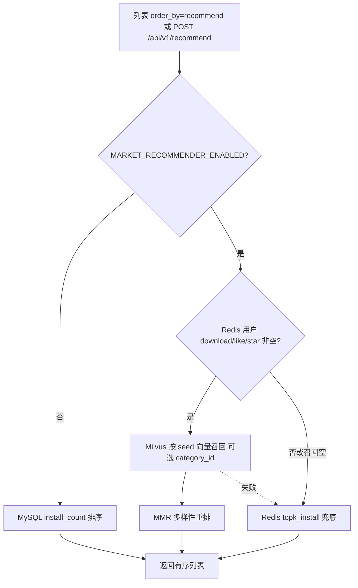

# 推荐系统

`marketplace/recommender/` 提供 SkillHub 个性化推荐：离线建库 + 在线召回。与 `marketplace/retrieval/`（语义搜索）相互独立，Embedding / Milvus / Redis key 均单独配置。

本地开发启用推荐前需安装可选依赖：`cd marketplace && uv sync --extra recommender`（`pymilvus`）。默认 `uv sync` 不含该项。

## 模块结构

| 路径 | 职责 |
|------|------|
| `recommender/offline/package_sync/` | 从 MySQL + 对象存储同步最新 Skill 包 |
| `recommender/offline/milvus_index/` | 解析 SKILL.md → Embedding → upsert Milvus |
| `recommender/offline/redis_sync/` | 用户行为序列与 install TopK 写入 Redis |
| `recommender/online/` | 在线召回、MMR、对外服务入口 |
| `recommender/shared/config.py` | 从 env 加载配置 |
| `plugins_market/recommender/` | 与 marketplace Settings / 列表 / HTTP 的桥接 |
| `plugins_market/routers/recommender.py` | HTTP API |

## 在线链路



- 种子顺序：download → like → star，去重后最多约 50 条；全部作为 Milvus 查询向量。
- 列表路径会先召回最多 `MARKET_REC_LIST_TOP_K`，再按当前页 hydrate，避免整页资产全量加载。
- MMR：`λ * relevance - (1-λ) * max_sim(selected)`，λ 由 `MARKET_REC_MMR_LAMBDA` 配置。

## 索引文本

离线默认向量化文本为：

```text
{name},{description}
```

description 来自 SKILL.md front matter（或正文回退）。语料质量参差时，类目纯度会受「同模板话术」（如大量 `*-review-team`）影响，属数据侧上限，而非链路故障。

## 与检索的差异

| | 检索 | 推荐 |
|--|------|------|
| 开关 | 检索相关 `MARKET_RETRIEVAL_*` | `MARKET_RECOMMENDER_ENABLED` |
| Embedding | `MARKET_RETRIEVAL_EMBEDDING_*` | `MARKET_REC_EMBEDDING_*` |
| 向量库 | FAISS 等检索工件 | Milvus collection |
| 触发 | `search_keyword` | 无关键词 + `order_by=recommend` / 独立 API |
| 冷启动 | 数据库模糊查询 | install TopK / MySQL `install_count` |

## 手动任务

在 `marketplace/` 目录、环境变量已加载时：

```bash
python -m recommender.offline.package_sync
python -m recommender.offline.milvus_index --mode incremental
python -m recommender.offline.milvus_index --mode full
python -m recommender.offline.redis_sync
```

## 相关文档

- [运维指南 / 推荐系统](../../6.%20运维指南/可选能力/推荐系统/README.md)（配置全表）
- [推荐系统 API](../../7.%20API参考/推荐系统API.md)
