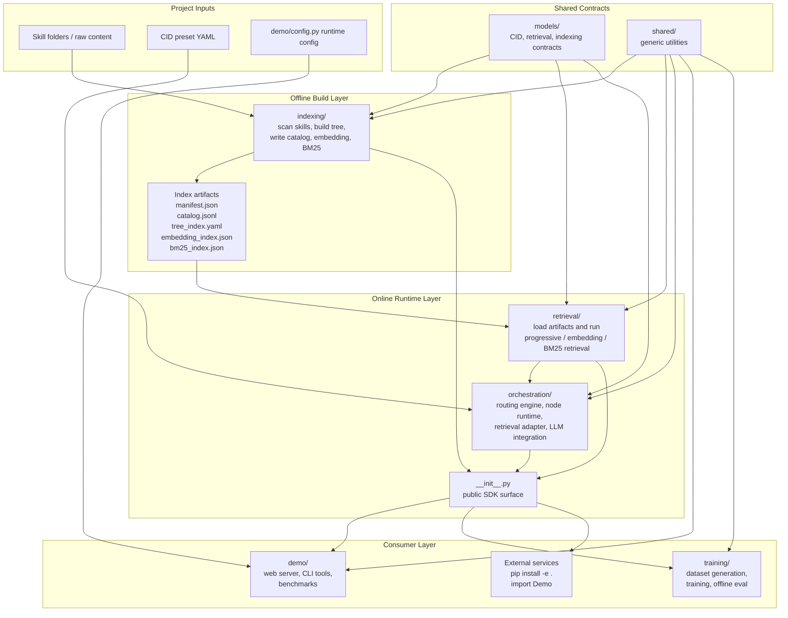

# Demo SDK Repository

This repository is organized around a single canonical code structure.

Core SDK code lives in `indexing/`, `retrieval/`, `orchestration/`, `models/`,
and `shared/`. Repository support directories such as `demo/`, `data/`,
`tests/`, `training/`, and `scripts/` are consumers, fixtures, or tooling; the
core packages do not import them as runtime dependencies.

Core packages:

- [indexing](/home/doujzc/codes/Demo/indexing): offline index construction
- [retrieval](/home/doujzc/codes/Demo/retrieval): online retrieval algorithms and APIs
- [orchestration](/home/doujzc/codes/Demo/orchestration): orchestration runtime and routing
- [demo](/home/doujzc/codes/Demo/demo): web demo, CLI tools, and benchmark utilities that consume the SDK
- [training](/home/doujzc/codes/Demo/training): dataset generation, training, and offline evaluation built on top of the SDK

Shared layers:

- [models](/home/doujzc/codes/Demo/models): shared data contracts
- [shared](/home/doujzc/codes/Demo/shared): shared utilities

SDK surface:

- non-demo packages are importable as a library and do not carry repository-level runtime API configuration
- top-level SDK exports live in [__init__.py](/home/doujzc/codes/Demo/__init__.py)
- runtime model/API configuration is kept inside [demo/config.py](/home/doujzc/codes/Demo/demo/config.py) for demos and local debugging only

There are no legacy runtime package roots in the repository anymore.

## Architecture

The repository is organized as a layered SDK with a separate demo consumer.



Main flow:

- `indexing/` builds offline artifacts from skill directories and writes the tree, catalog, embedding index, and BM25 index.
- `retrieval/` loads those artifacts and exposes unified search over progressive tree search, embedding retrieval, and BM25 retrieval.
- `orchestration/` sits above retrieval and uses CID presets, prompts, node runtime state, and LLM clients to drive routed execution.
- `demo/` is a consumer of the SDK for local web, CLI, and benchmark scenarios; it owns runtime configuration but not the core retrieval/orchestration implementation.
- `training/` reuses the SDK and shared contracts for dataset generation, evaluation, and model-training workflows.
- `data/`, `tests/`, and `scripts/` support local development, fixtures, and tooling; they are not imported by the core SDK packages.

## SDK Usage

Install the SDK into another service:

```bash
pip install -e .
```

Then import from the canonical packages:

```python
from retrieval.service.retriever import Retriever

retriever = Retriever.from_index("/path/to/index")
```

Typical SDK responsibilities:

- build offline indexes
- load and search retrieval indexes
- construct orchestrator runtimes

Typical non-SDK responsibilities:

- API keys
- model/base URL wiring
- deployment-specific runtime configuration
- local demo behavior

## Demo Usage

`demo/` is a consumer of the SDK, not a second implementation of it.

- [demo/config.py](/home/doujzc/codes/Demo/demo/config.py) holds demo-only runtime settings
- [demo/sdk.py](/home/doujzc/codes/Demo/demo/sdk.py) imports the SDK the same way an external service would
- `demo/web`, `demo/cli`, and `demo/benchmark` provide examples and debugging utilities built on top of the SDK

Build an offline index:

```bash
python -m demo.cli.build_index
```

Run the web demo:

```bash
python -m demo.web.server
```

Generate pseudo skills from `data/raw_data.json`:

```bash
python -m demo.cli.build_pseudo_skills
```

Run the batch top-k benchmark:

```bash
python -m demo.benchmark.batch_topk_recall --input data/raw_data.json
```

Visualize a benchmark report:

```bash
python -m demo.benchmark.visualize_batch_topk_recall --input data/index/batch_topk_recall_report.json
```

## Canonical Entry Points

- Offline indexing: [indexing/workflows/index_builder.py](/home/doujzc/codes/Demo/indexing/workflows/index_builder.py)
- Retrieval API: [retrieval/service/retriever.py](/home/doujzc/codes/Demo/retrieval/service/retriever.py)
- Progressive retrieval: [retrieval/tree/progressive.py](/home/doujzc/codes/Demo/retrieval/tree/progressive.py)
- Orchestrator engine: [orchestration/engine/orchestrator.py](/home/doujzc/codes/Demo/orchestration/engine/orchestrator.py)
- Web runtime: [demo/web/runtime.py](/home/doujzc/codes/Demo/demo/web/runtime.py)
- Web server: [demo/web/server.py](/home/doujzc/codes/Demo/demo/web/server.py)

## Documentation

- Final refactor summary: [refactor.md](/home/doujzc/codes/Demo/refactor.md)
- Repository architecture overview: [doc.md](/home/doujzc/codes/Demo/doc.md)
- Module layout summary: [docs/module_layout.md](/home/doujzc/codes/Demo/docs/module_layout.md)
- Indexing notes: [indexing/doc.md](/home/doujzc/codes/Demo/indexing/doc.md)
- Retrieval notes: [retrieval/doc.md](/home/doujzc/codes/Demo/retrieval/doc.md)
- Retrieval algorithm flow: [retrieval/algorithm.md](/home/doujzc/codes/Demo/retrieval/algorithm.md)
- Public API summary: [retriever_api.md](/home/doujzc/codes/Demo/retriever_api.md)
